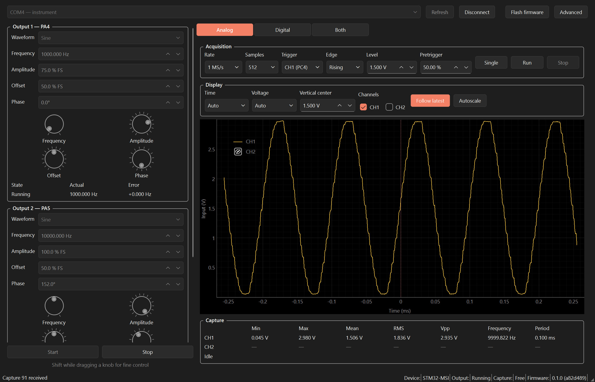
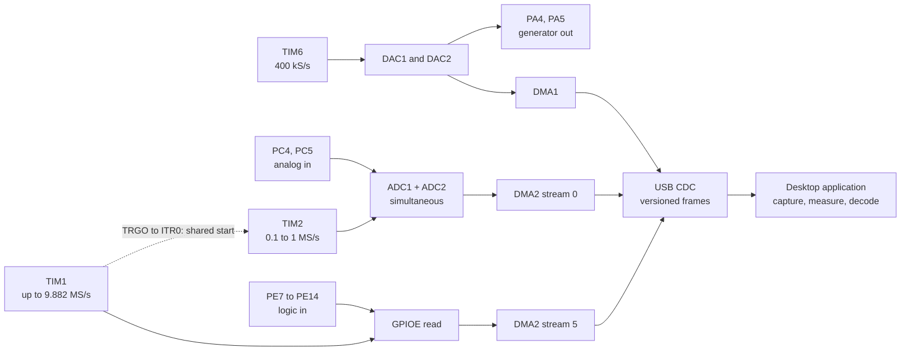
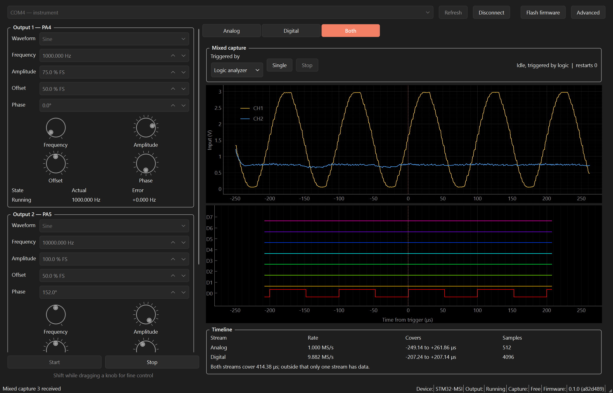

# STM32 Mixed-Signal Instrument

A PC-controlled waveform generator, oscilloscope and logic analyzer built around an
STM32F407G-DISC1. Two analog outputs, two analog inputs, eight logic inputs, and a mode that
puts the analog and digital captures on one timeline.



**Status:** the two-channel AWG covers 1 Hz to 20 kHz on PA4 and PA5. The desktop
application controls both outputs, captures two analog inputs on PC4 and PC5 at
100 kS/s to 1 MS/s, and captures eight logic inputs on PE7..PE14 at 1 to 10 MS/s.
Analog characterization and logic timing limits remain open.

## How it fits together

One crystal drives every timer, which is what makes a shared timebase possible: TIM1's
trigger output releases TIM2, so an analog and a digital capture start from the same event.



## Platform

- STM32F407VGT6, Cortex-M4F, 168 MHz
- C, STM32 HAL, FreeRTOS with CMSIS-RTOS v2, CMake, Ninja and Arm GNU Toolchain
- Python desktop package with a PySide6 interface
- Native USB CDC for device control and finite capture transfer

## Repository

| Directory | Contents |
| --- | --- |
| `firmware/` | Instrument application, host C tests, CubeMX initialization and vendor drivers |
| `desktop/` | Python package and host tests |
| `protocol/` | Shared communication contract |
| `docs/` | Architecture and roadmap |
| `scripts/` | Host validation |

## Installing

Download `stm32-msi-<version>.exe` from a release and run it. There is nothing to install:
it carries its own interpreter and the matching firmware. Plug the board into CN1, press
**Flash firmware**, then **Connect**.

Flashing needs [STM32CubeProgrammer](https://www.st.com/en/development-tools/stm32cubeprog.html)
installed. It is ST's own tool and cannot be shipped here; it is what drives the ST-LINK on
the board. If it is missing the application says so and offers to open the download page,
rather than failing with a name you then have to search for. Everything else works without
it.

The application writes the image, then reconnects and asks the board what it is, so a flash
that did not take is reported rather than assumed.

Working from a checkout instead:

```text
python -m pip install ./desktop
stm32-msi-gui
python scripts/flash.py --port COM4
```

The application warns when the firmware is older than it expects, naming both versions, and
stays connected: a mismatch may not matter to what you are doing, but you should know it is
there.

## Device control

The desktop application and CLI use the native CDC port on CN5, separate from
ST-LINK. The CLI is available for direct checks:

```text
stm32-msi --port COM5 status
stm32-msi --port COM5 stop
stm32-msi --port COM5 configure triangle 500
stm32-msi --port COM5 start
```

Replace COM5 with the enumerated CDC port. [Protocol](protocol/README.md)

## Waveform generator

Two independent outputs on PA4 and PA5 produce sine, triangle, square, sawtooth, DC and
2..256-entry arbitrary tables from 1 Hz to 20 kHz; boot starts a 1 kHz sine on PA4. A
32-bit phase accumulator clocked at 400 kS/s gives a 93.13 uHz frequency step, finer than
the millihertz the protocol accepts. Amplitude, offset and phase are set per channel to
0.1 resolution, as percentages of DAC full scale and as degrees. Amplitude is peak-to-peak
and offset is the center, and combinations that would exceed the DAC range are rejected
rather than silently clipped.

Each channel streams through circular DMA in 512-sample halves with a 1.28 ms refill
deadline. A refill that misses its half faults and stops the timer instead of repeating
stale samples. Both outputs can run while the scope or logic analyzer captures.

Absolute amplitude accuracy, distortion and bandwidth remain uncharacterized, and PA4 is
loaded by the board's audio codec connection.

## Scope

The oscilloscope captures 64 to 2048 simultaneous sample pairs from PC4 and PC5.
It supports free-run, rising and falling triggers, adjustable pre-trigger position,
single or continuously refreshed plots, time/div and volts/div scaling, pan/zoom,
and basic voltage and timing measurements.

## Logic analyzer

Eight inputs on PE7..PE14 are sampled together at a requested 1, 2, 5 or 10 MS/s;
the timer divides 168 MHz, so the application reports the rate actually programmed.
Captures hold 64 to 4096 samples with free-run, edge and masked-pattern triggers and
an adjustable pre-trigger position. The desktop view draws eight traces, measures
transitions, duty, shortest pulse, frequency and edge jitter per channel, and decodes
UART, SPI and I2C.

Short pulses can be missed without a DMA error. Asynchronous pulse limits remain
uncharacterized; 10 MS/s is experimental.

## Mixed signal

Both captures can run from one timer event, so analog and digital samples sit on a single
timeline. Each stream reports where its window begins relative to that shared start, and
the desktop draws both against one time axis with zero at the trigger. Only one stream
may hold the trigger; the other free-runs and is placed by index.

A shared start is not a shared sampling instant. Measured skew between the two paths is
-119.7 ns, which is the ADC's sample-and-hold aperture; no jitter is resolvable above the
sampling quantization.



One sine reaches an analog input and a logic input. The upper trace is the wave, the lower
is where it crosses the digital input's threshold, and the timeline underneath reports what
each stream covers and where they overlap. Outside that overlap only one stream has data,
which the display says rather than leaving you to infer.

## Desktop application

Sources on the left, one display on the right. Both waveform outputs and the PC6 reference
stay in view while you work, and the display switches between analog, digital, and both on a
single timeline. Whichever you choose, Single takes one capture and Run refreshes
continuously.

Advanced holds the things you set once or read only when a capture looks wrong: the supply
reference used to convert ADC codes to volts, the masked pattern trigger, and the error
counters.

## Concurrency

FreeRTOS separates waveform refill, acquisition, USB control and status.
Scope and logic acquisition are mutually exclusive; AWG can run alongside either.
Board checks cover concurrent load, stack headroom, refill latency, fault recovery
and USB backpressure.

This is an unprotected low-voltage prototype. Inputs must stay within the board's
actual supply/reference limits. No mains, negative-voltage or automotive inputs.

[Architecture](docs/architecture/OVERVIEW.md) | [Roadmap](docs/PLAN.md) | [Validation](docs/validation.md) | [Characterization](docs/characterization.md)
